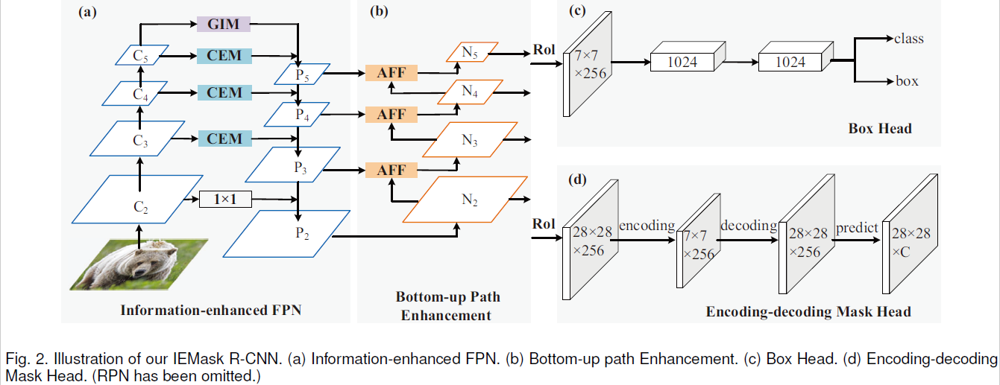
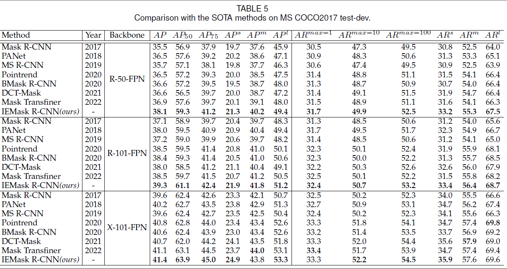

<h2 align="center">IEMask R-CNN: Information-enhanced Mask R-CNN</h2>
<h4 align="right">by <a href="http://faculty.cqupt.edu.cn/bixiuli/zh_CN/index.htm">Xiuli Bi</a>, <a href="https://fhujinwu.github.io/">Jinwu Hu</a>, <a href="https://faculty.cqupt.edu.cn/xiaobin/zh_CN/index.htm">Bin Xiao*</a>, <a href="https://faculty.cqupt.edu.cn/liws/zh_CN/index.htm">Weisheng Li</a>, <a href="https://see.xidian.edu.cn/faculty/xbgao/">Xinbo Gao</a></h4>

<div align="center">
  <br><br>
</div>
<div align="center">
  <br><br>
</div>

This is an official implementation of IEMask R-CNN in our IEEE Transactions on Big Data paper "
<a href="https://ieeexplore.ieee.org/document/9811396">
IEMask R-CNN: Information-enhanced Mask R-CNN</a>"

## Note
Our code is based on the <a href="https://github.com/facebookresearch/detectron2">
Detectron2</a> and <a href="https://github.com/hustvl/BMaskR-CNN">BMask R-CNN</a> implementation.


## Citation
If you use IEMask R-CNN in your research, please cite our coming IEEE Transactions on Big Data paper.

```text
@ARTICLE{IEMask,
  author={Bi, Xiuli and Hu, Jinwu and Xiao, Bin and Li, Weisheng and Gao, Xinbo},
  journal={IEEE Transactions on Big Data}, 
  title={IEMask R-CNN: Information-enhanced Mask R-CNN}, 
  year={2022},
  volume={},
  number={},
  pages={1-13},
  doi={10.1109/TBDATA.2022.3187413}}
```
 
## update status
The code (V1) is uploaded (Ongoing updates).

